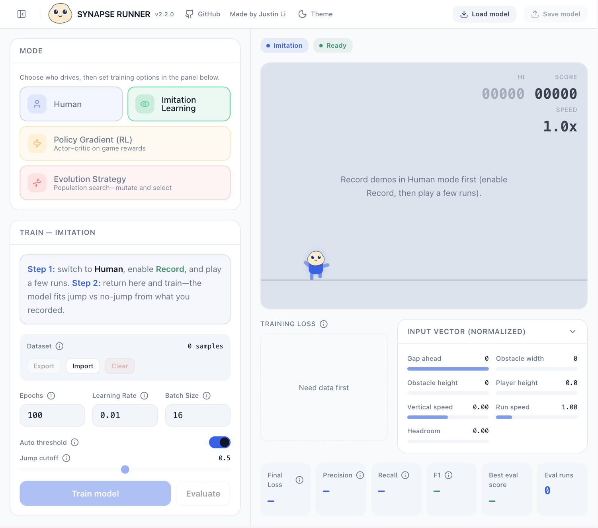

# Synapse Runner

[](https://github.com/JustinLi6886/synapse-runner/actions/workflows/ci.yml)



*Screenshot: **Imitation learning** — record demos, train behavioral cloning, inspect metrics.*

**Live:** [synapserunner.com](https://www.synapserunner.com/) · **Repo:** [github.com/JustinLi6886/synapse-runner](https://github.com/JustinLi6886/synapse-runner) · **Current release:** `v2.2.0`

A browser runner where the point isn’t flashy graphics—it’s an end-to-end **play → observe → train** loop in TypeScript. One game engine drives human control, recorded demos, and learning, all without a backend for the core experience.

**At a glance (resume-friendly):** React, Vite, custom side-scroller simulation, small neural nets implemented in TS (forward passes, losses, policy-gradient and evolution updates), persisted settings/models in `localStorage`, and live training metrics in the UI.

---

## Why it exists

I wanted a project where “it runs in the game” isn’t hand-wavy: observations come from real state, and the nets either clear obstacles or they don’t. The dashboard is busy on purpose—thresholds, vectors, and charts—so you can see whether training is doing something useful.

---

## Modes

| Mode | What you do |
|------|----------------|
| **Human** | Play with keyboard or tap; the reference behavior. |
| **Imitation** | Record frames, behavioral cloning on your data, export/import datasets. |
| **Policy gradient** | Actor–critic rollouts, GAE-style advantages, greedy eval, charts. |
| **Evolution** | Population fitness, mutation, generations. |

---

## Stack

| Layer | Notes |
|--------|--------|
| **UI** | React 19, Tailwind CSS 4, Recharts, Lucide icons |
| **Build** | Vite 7, TypeScript ~5.9, ESLint |
| **ML** | Feedforward nets in TS—e.g. BCE/MSE training, policy-gradient updates |
| **State** | `localStorage` persistence, sanitized imports |

---

## Run locally

**Node 20+** (see `engines` in `package.json`).

```bash
npm install
npm run dev
```

Open the URL Vite prints (this project defaults to port **3000**).

```bash
npm run build    # typecheck + production bundle
npm run lint
npm run preview  # optional: serve the production build locally
```

---

## License

[MIT](./LICENSE) — Copyright (c) 2026 Justin Junze Li.

Feedback and bug reports are welcome via GitHub issues.
